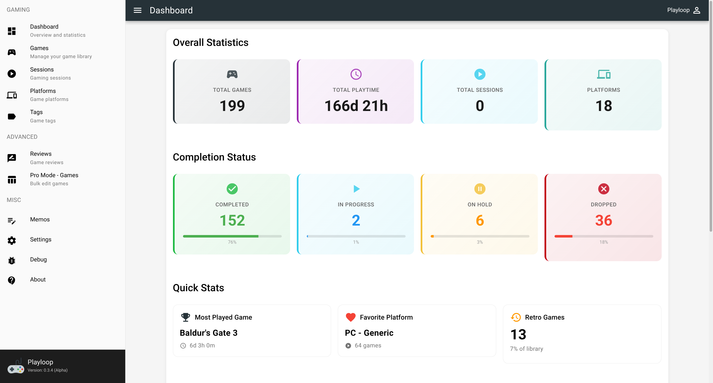
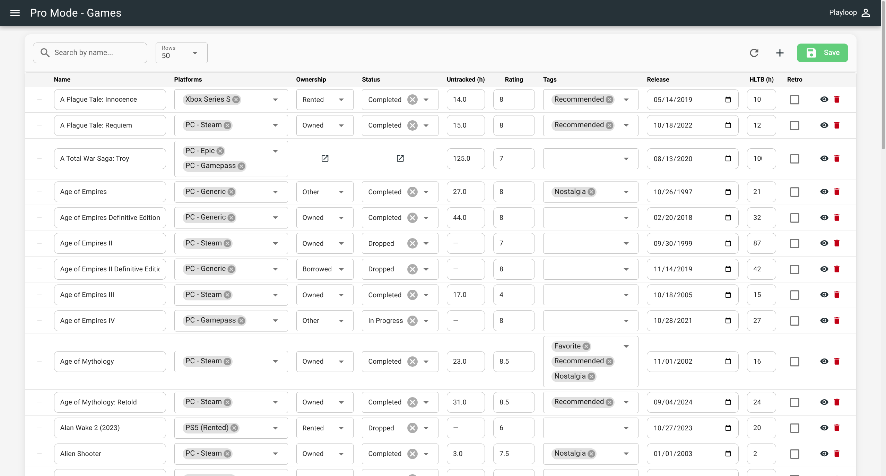
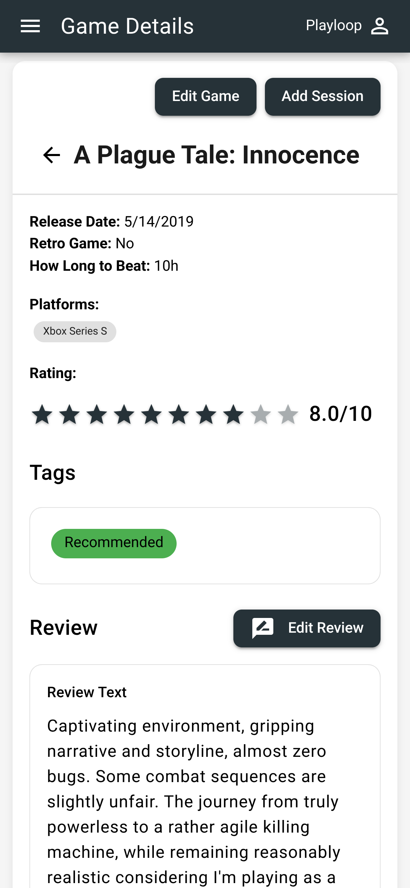
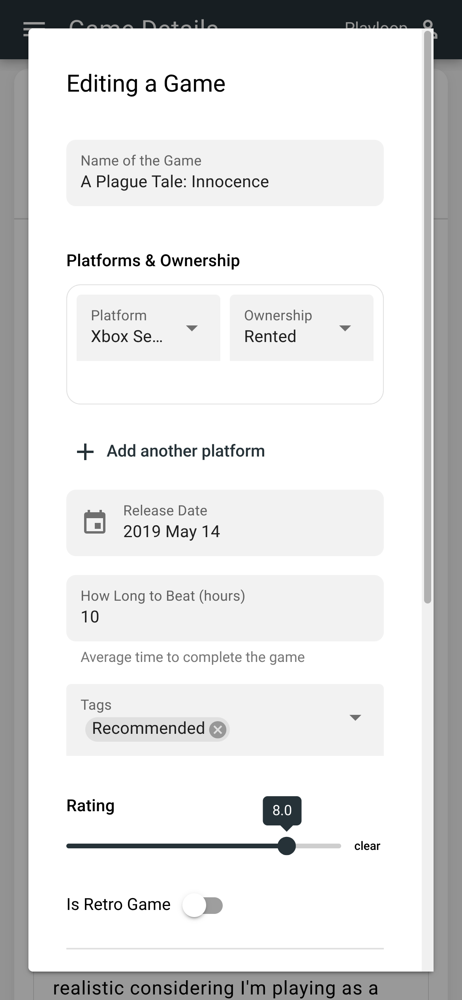

# Playloop™

Track and plan your gaming like never before.

---

## Screenshots

### Dashboard (desktop)



Stats, completion breakdown, and recently played games.

### Pro Mode (desktop)



Bulk-edit games in a spreadsheet-style view.

### Game detail (mobile)



Sessions, platforms, status, and playtime for a game.

### Edit game (mobile)



Update game details, ownership, and completion status.

---

## About

**Playloop** is a personal gaming library and playtime tracker built as a Progressive Web App (PWA). It works offline and helps you keep track of your games, platforms, sessions, completion status, and reviews in one place.

### Key Features

- 🎮 **Library:** Games, platforms, tags, ownership, and completion status per platform
- ⏱️ **Playtime:** Manual sessions and untracked playtime; total hours and recency on dashboard
- 📊 **Stats:** Total playtime (days/hours/minutes), completion breakdown, most played game, favorite platform
- 📝 **Reviews:** Per-game reviews with aspect ratings
- ⚡ **Pro Mode:** Bulk-edit games in a spreadsheet-style view (ownership, status, rating, tags, HLTB, and more)
- 📱 **Offline-first:** Data stored locally with PouchDB; optional sync when online
- 🌙 **PWA:** Install and use like an app

### Technology Stack

- **Frontend:** Vue 3 with Composition API
- **UI Framework:** Quasar Framework (Material Design)
- **Language:** TypeScript
- **Offline Storage:** PouchDB
- **Build Tool:** Quasar CLI with Vite

## Development Setup

### Install dependencies

```bash
npm install
```

### Set up environment variables

Create a `.env` file in the root directory using `.env.example` as a template (if present):

```bash
cp .env.example .env
```

### Start development server

```bash
npm run dev
```

### Type checking

```bash
npm run type-check
```

### Lint and format

```bash
npm run lint
npm run format
```

### Build for production

```bash
npm run build
```

## Author

**Sayem Shafayet**

- 🌐 [ishafayet.me](https://ishafayet.me)
- 💼 [GitHub @iShafayet](https://github.com/iShafayet)

## Links

- **Repository:** [iShafayet/playloop](https://github.com/iShafayet/playloop)
- **Live app:** [Playloop](https://playloop-usa.uc.r.appspot.com/#/dashboard)
